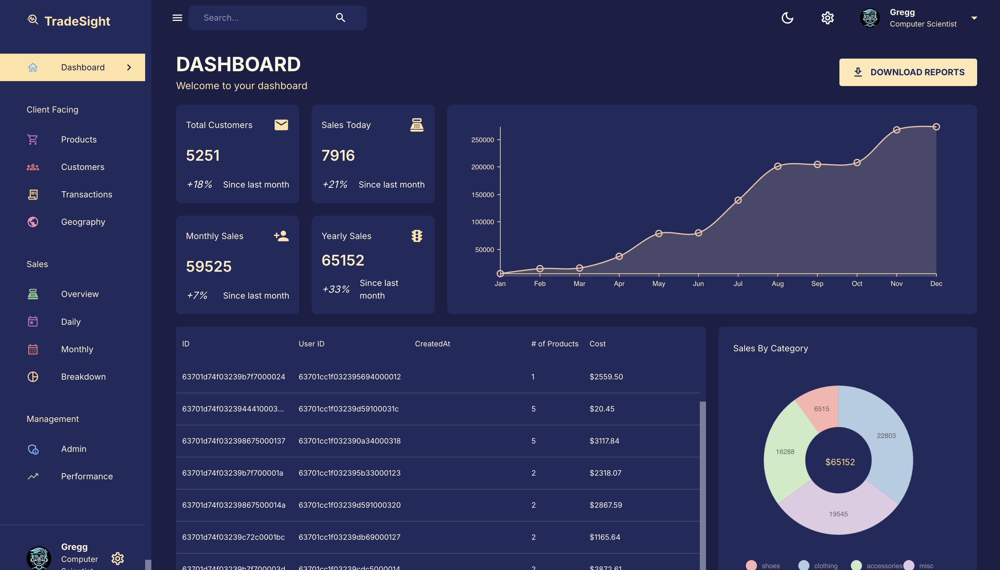

# TradeSight Admin Dashboard

[Live Demo](https://trade-sight-app.onrender.com/)

## Overview
TradeSight is a modern admin dashboard for business analytics and management. It provides a comprehensive view of sales, customers, products, transactions, and geographic data, all in a visually appealing and interactive interface.

### Key Features
- **Dashboard Analytics:** Visualize sales, customer growth, and product performance with interactive charts and tables.
- **Product & Customer Management:** Browse, search, and manage products and customers efficiently.
- **Sales Tracking:** Monitor daily, monthly, and yearly sales, including breakdowns by category and geography.
- **Responsive UI:** Built with Material-UI and Nivo charts for a seamless experience across devices.
- **Admin & Performance Tools:** Access management and performance insights for business optimization.

---
